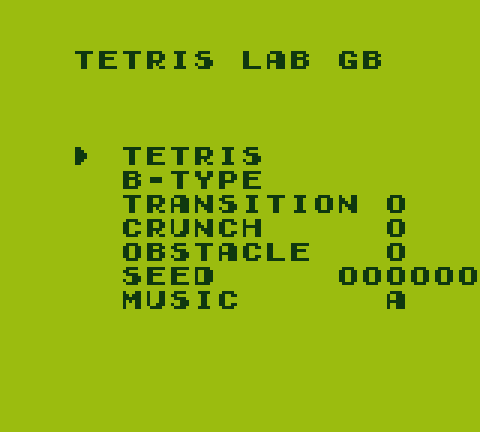
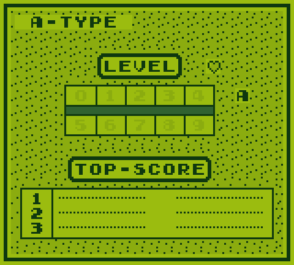
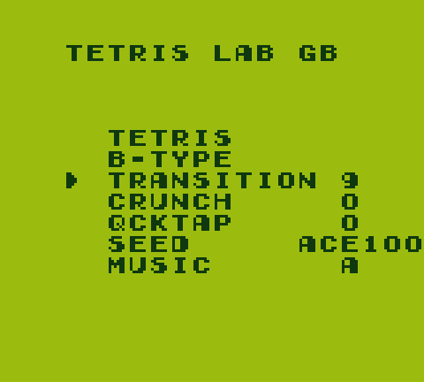
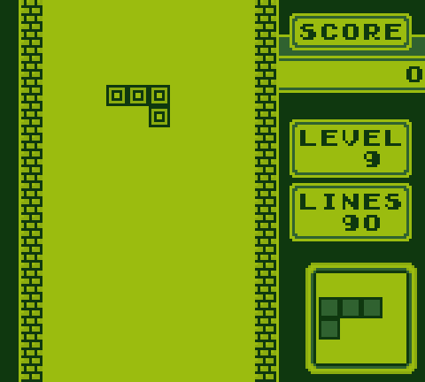
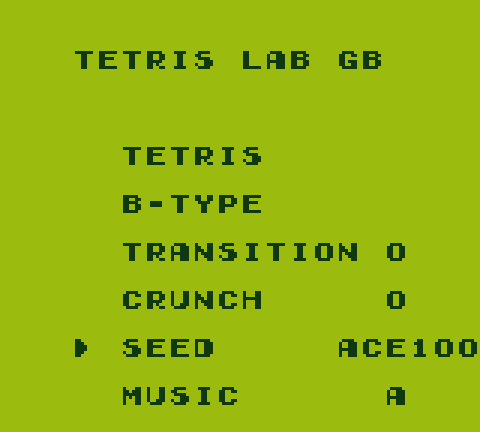

# Tetris Lab GB

**A training and practice ROM for the original Nintendo Game Boy Tetris (1989)**, modelled on
[TetrisGYM](https://github.com/kirjavascript/TetrisGYM) for the NES.

> Renamed from `tetris-gym-gb` in August 2026, at the request of TetrisGYM's author, relayed by
> Tolstoj — two projects with the same name in the same scene would only confuse people. The old
> URL still redirects.

> **Status:** see [`docs/roadmap.md`](docs/roadmap.md).
> Working today: the Lab menu, level select up to M, hearts, the transition trainer, SPS and instant restart.
> [**Get v0.3.0**](https://github.com/Giovanniclini/tetris-lab-gb/releases) — or see
> [Play it](#play-it).

---

## What this is

[TetrisGYM](https://github.com/kirjavascript/TetrisGYM) gave the NES Tetris community a practice ROM
built on top of a disassembly of the original game: same gameplay, same timings, same feel, plus the
training tools competitive players actually need.

**Nothing equivalent exists for Game Boy Tetris.** This project builds it.

There *is* a real audience. The [Classic Tetris World Championship — Game
Boy](https://liquipedia.net/tetris/CTWCGB/2025) has run annually since 2023, organised by the
GBTetris Discord, with international qualifiers. Physical CTWC regionals run Game Boy side events —
[CTWC France 2026](https://liquipedia.net/tetris/CTWC_France/2026/Game_Boy) had 24 players and a
prize pool. [speedrun.com](https://www.speedrun.com/tetrisgb) tracks three active categories.

And their competitive formats are **not** the NES formats:

| | NES Tetris | **Game Boy Tetris** |
| --- | --- | --- |
| Tournament qualifier | A-Type score from level 18 | **40-line sprint, best time** |
| Bracket format | Score duel | **Link-cable head-to-head VS** |
| Speed ceiling | Level 29 killscreen | **Level 20 + "heart" levels (+10 speed)** |
| DAS | 16 frames + 6 | **23 frames + 9** |

So this is not a port of TetrisGYM's feature list. It is a training tool designed from what Game Boy
players actually compete at — starting with the thing the original game conspicuously lacks:
**a timer**.

## Design principle

**Preserve the original game exactly. Add training tools around it.**

The gameplay stays the original machine code — bit for bit. Gravity, DAS, ARE, the biased
randomizer, the left-handed rotation system, the 10×18 playfield, the quirks. All of it, unchanged
and *provably* unchanged: the build reproduces the original ROM byte-exactly, and that check runs on
every commit.

This is deliberately **not** a modernisation. No hold, no hard drop, no ghost piece, no SRS.
[Tetris — Rosy Retrospection](https://www.romhacking.net/hacks/5813/) already does that well, and
does not need competition.

## Play it

You need your own copy of **`Tetris (World) (Rev A)`** — md5
`982ed5d2b12a0377eb14bcdc4123744e`. This project never distributes ROM data.

Download `tetrislab.bps` from
[Releases](https://github.com/Giovanniclini/tetris-lab-gb/releases), then apply it:

```
python3 tools/patch.py tetrislab.bps "Tetris (World) (Rev A).gb"
```

That writes `tetrislab.gb`. Any BPS patcher works too (Floating IPS, beat, Rom Patcher JS);
the script is here so you need nothing but Python 3.

Or build it from source — no ROM required, since the ROM is rebuilt from the disassembly:

```
git clone https://github.com/Giovanniclini/tetris-lab-gb
cd tetris-lab-gb
python3 build.py          # -> build/tetrislab.gb
```

Run it in [SameBoy](https://sameboy.github.io/), BGB, Emulicious or mGBA, or copy it to an
EverDrive GB or EZ-Flash Junior. **In mGBA, set *Settings → Game Boy → Game Boy model →
Game Boy Color*** or the screen is greyscale — see [below](#known-quirk-greyscale-in-some-emulators).

### Controls

| Where | Press | Does |
| --- | --- | --- |
| Lab menu | `Up` / `Down` | move between rows |
| Lab menu | `Left` / `Right` | change the value on the row |
| Lab menu | `Start` or `A` | launch the mode |
| Level select, grid cell `9` | `Right` | into the level picker |
| Level picker | `Up` / `Down` | choose `0`–`9` then `A`–`M` |
| Level select | `Select` | toggle hearts |
| Any time in a game | `A`+`B`+`Select`+`Start` | restart the same drill |

## Trainers



The A-TYPE/B-TYPE screen is the Lab menu, modelled on
[TetrisGYM's](https://github.com/kirjavascript/TetrisGYM): one list, playable modes first,
settings after, each row carrying its own value. `Up`/`Down` move, `Left`/`Right` change the
value on the row, `Start` launches.

Boot lands here in about a second — the copyright screen is skipped.

### Tetris



A-Type, with the original grid untouched and a picker beside it: `Right` off cell `9` to reach
it, then `Up`/`Down` for `0`–`9` and `A`–`M`. `M` is one row per frame, the engine's ceiling.

`Select` toggles **hearts** — the original's hidden `Down`+`Start`, made visible, with an
indicator beside `LEVEL`. They add ten levels of speed, and are withheld above level 20 because
the original computes them as `min(level + 10, 20)`, which past 20 clamps *downward* and would
make the game slower.

The score no longer stops at 999,999 — it runs to 9,999,999. The original pins it there because three BCD bytes hold six
digits; a seventh is kept alongside and drawn into the panel's left edge, which is where the room
is. Seven digits is all the panel has room for — the spare cell to the right of the score — so it pins there rather than counting into a digit it cannot show.

High score entries carry the seventh digit too, in the dotted gap the original leaves between the
name and the score, and they are ranked by it — otherwise a 1 000 050 stored as its low six digits
would lose to a 999 999.

The rocket scene never plays. The original spends 2.4 seconds waiting and twenty-odd more on a
launch, at exactly the scores a good session produces; topping out now returns you to the game over
screen in two frames, by the same path the original already uses for scores under 100,000.

Holding `Down` does nothing at `L` and `M`. Pushdown moves a piece every 3 frames whatever the
level, and those two fall in 2 and 1 — so it would make them *slower*. No push, so no drop points
there either.

The `TOP SCORE` panel follows the level you are about to play. `A`–`M` have their own slots.

### Transition




Start ten lines short of your level's speed change, so you can drill the part that matters
instead of the hundred lines in front of it.

Game Boy's transition is the level-up threshold, and the original treats your starting level as
the number of tens to clear — so a level 9 start levels up at 100 lines and the drill begins at
90. The row carries its own level and starts the game directly; instant restart then repeats
the same drill.

Modelled on TetrisGYM's `TRANSITION`, minus its score preset: that exists for NES's pace
readout, which the Game Boy does not have.

### Seed



Same seed, same pieces — **and the same pieces as the community's existing seeded ROM**, because
this uses that LFSR bit for bit rather than a better one. Interoperability is the whole point of
a fairness mechanism.

`A` opens the four digits, `Left`/`Right` pick one, `Up`/`Down` change it, `A` closes them. The
seed applies to every mode, including B-Type's starting garbage, and is reloaded at the start of
every game so a restart repeats a sequence rather than continuing it.

`0000` means **no seed**: pieces come from the hardware timer, exactly as the original does.

### B-Type

The original B-Type, reached from the menu. Its level and height selection are untouched.

### 2 Player

Link-cable head-to-head, the format CTWC-GB runs its brackets on. The menu keeps pinging for a
partner every frame, the way the title screen it replaced did, and hands over the moment one
answers.

**Untested on hardware.** Nobody involved has a link cable and no emulator here can carry one, so
what is verified is that the bytes on the wire are the original's, that the ping never stops, and
that the fallbacks behave. See [`docs/decisions/0007`](docs/decisions/0007-lab-menu-mirrors-tetrisgym.md).

### Instant restart

`A`+`B`+`Select`+`Start` restarts the current drill in about 0.15 s, instead of rebooting through
fifteen seconds of logos and menus. It works during a game, on the game-over screen, and while
typing a high score name — abandoning the score is the point when you are drilling.

You get the level you *chose*, not the level you reached.

---

*Screenshots are regenerated from the ROM by `.venv/bin/python tools/screenshots.py`.*

## Technical approach

| | |
| --- | --- |
| **Target ROM** | `Tetris (World) (Rev A)` — "v1.1" · MD5 `982ed5d2b12a0377eb14bcdc4123744e` · SHA-1 `74591cc9501af93873f9a5d3eb12da12c0723bbc` |
| **Foundation** | [`vinheim3/tetris-gb-disasm`](https://github.com/vinheim3/tetris-gb-disasm) (MIT, 100 % coverage) — verified to build byte-exactly |
| **Toolchain** | RGBDS v0.6.1, downloaded and SHA-256-verified into `build/`. No system-wide installs. |
| **Build** | `python3 build.py` — Python 3 stdlib only. No `make`, no `gcc`. |
| **Cartridge** | MBC1, 128 KB ROM, 8 KB battery SRAM. The original 32 KB ROM has only ~400 free bytes. |
| **Distribution** | **BPS patch only.** You supply your own ROM. `python3 build.py --patch` builds it. |

Full reasoning in [`docs/architecture.md`](docs/architecture.md) and
[`docs/research.md`](docs/research.md).

## Why real hardware needs a flash cart

An [EverDrive GB](https://krikzz.com/our-products/cartridges/edgbx7.html) or an EZ-Flash Junior,
which load `.gb` files from an SD card. *This is not a restriction this project introduces.* A retail Game Boy Tetris cartridge contains
**mask ROM** — etched during chip fabrication and physically unwritable. A Game Genie can patch
cartridge reads at runtime on a genuine cart, but only three codes at a time, which is enough for a
level-start tweak and nowhere near enough for a Lab. Anything larger needs a flash cart.

Our expansion to an MBC1 cartridge (needed because the original 32 KB ROM has only ~400 free bytes)
therefore costs nothing to emulator, flash-cart, Analogue Pocket or MiSTer users. The only people it
affects are those building their own repro cartridges, who now need a board with an MBC1 and battery
SRAM rather than a bare 32 KB flash chip.

## Known quirk: greyscale in some emulators

Game Boy Tetris is a DMG game — it has no colour of its own. The familiar palette comes from the
Game Boy Color boot ROM, which colourises Nintendo-published games automatically.

The patched ROM keeps every input to that lookup byte-identical, so **on real Game Boy Color
hardware it colourises exactly like the original**. But some emulators — mGBA among them —
identify games by CRC32 against a database instead, and a patched ROM naturally isn't in it, so
they fall back to greyscale.

In mGBA: *Settings → Game Boy → Game Boy model → **Game Boy Color***.

## Documentation

| | |
| --- | --- |
| [`CLAUDE.md`](CLAUDE.md) | Project principles — **read first**, human or AI |
| [`docs/research.md`](docs/research.md) | TetrisGYM analysis, Game Boy Tetris internals, disassembly evaluation, hardware constraints, legal notes |
| [`docs/community-research.md`](docs/community-research.md) | Community evidence, feature matrix, top 10 |
| [`docs/architecture.md`](docs/architecture.md) | Architecture decisions, layout, memory, build, testing |
| [`docs/roadmap.md`](docs/roadmap.md) | Milestones and acceptance criteria |

## Contributing

Contributions are welcome. [`CONTRIBUTING.md`](CONTRIBUTING.md) has the workflow, the local
build and test commands, and the rules that matter. [`docs/roadmap.md`](docs/roadmap.md) has
what is planned and what is done.

Especially useful right now:

* **Play it and report what feels wrong.** If a timing does not match what you are used to,
  that is a bug — say which level, which mode, and what you expected.
* **Test it on real hardware.** Nobody has. Whether it boots on a DMG or GBC from an EverDrive
  GB or EZ-Flash Junior is an open question.
* **Answer a question about how Game Boy Tetris is actually played.** Several are open in
  [`docs/community-research.md`](docs/community-research.md) §7 — the online qualifier format,
  which hardware people practise on, the exact start and stop frames of the community's sprint
  timer. Most are one line from anyone who competes.
* **Code.** Take something from the roadmap or bring your own. Open an issue first for anything
  large, so we do not both build it.

The rule that overrides everything: `python3 build.py --original` must keep reproducing the
stock ROM byte-exactly. A change that cannot keep that green is the wrong change.

## Licence and legal

Project code: MIT (planned). The vendored disassembly is MIT-licensed by its author.

**Note that an author's licence over a disassembly covers their annotation and organisation work; it
cannot grant rights over Nintendo's, TTC's or Elorg's underlying content.** Game Boy Tetris is
copyrighted. This project distributes source and patches, never ROM data, and is unaffiliated with
Nintendo, The Tetris Company or any rights holder.

## Credits

* **The GBTetris community's romhackers**, whose work this is built on top of in three concrete
  places. The **KLM romhack** — Ospin, Tolstoj, Pascal and Hepps in lineage — established levels
  `A`–`M`; our `L` and `M` gravity values match it exactly, and so does the way we stop levelling
  at 20 or above, so a practice level means the same thing on both. The 16-bit **LFSR** came from
  the seeded ROM in circulation, transcribed byte for byte rather than replaced — **found by
  Ospin**, who dug it out of the public literature rather than writing it.
* **Tolstoj**, for the reverse-engineering conversations, for the standing offer to hand off KLM
  hosting, and for reporting the SPS reset bug that our own tests could not see
  (`docs/existing-hacks.md`)
* [kirjavascript/TetrisGYM](https://github.com/kirjavascript/TetrisGYM) — the model for this project,
  and the proof the approach works
* [vinheim3/tetris-gb-disasm](https://github.com/vinheim3/tetris-gb-disasm) — the disassembly this is built on
* [kaspermeerts/tetris](https://github.com/kaspermeerts/tetris) and
  [meithecatte/gbtetris](https://github.com/meithecatte/gbtetris) — reference disassemblies whose
  documentation and memory maps informed the research
* [RGBDS](https://rgbds.gbdev.io/) and [gbdev](https://gbdev.io/) — the toolchain and the community
  that maintains it
